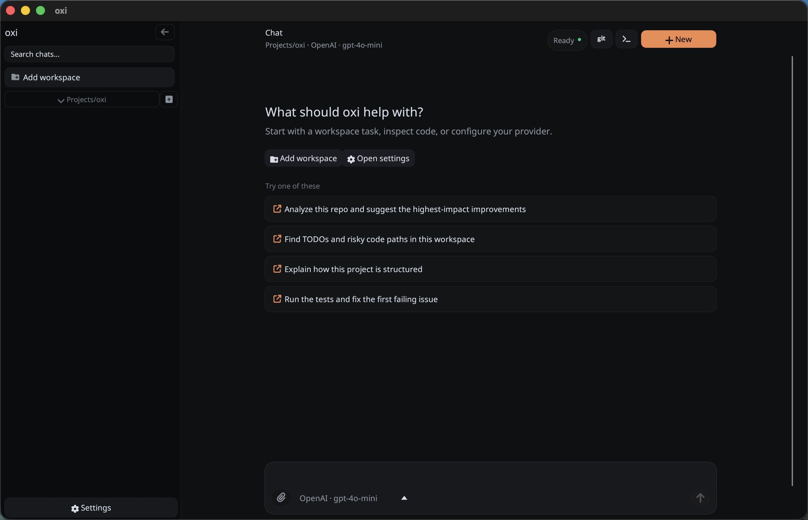
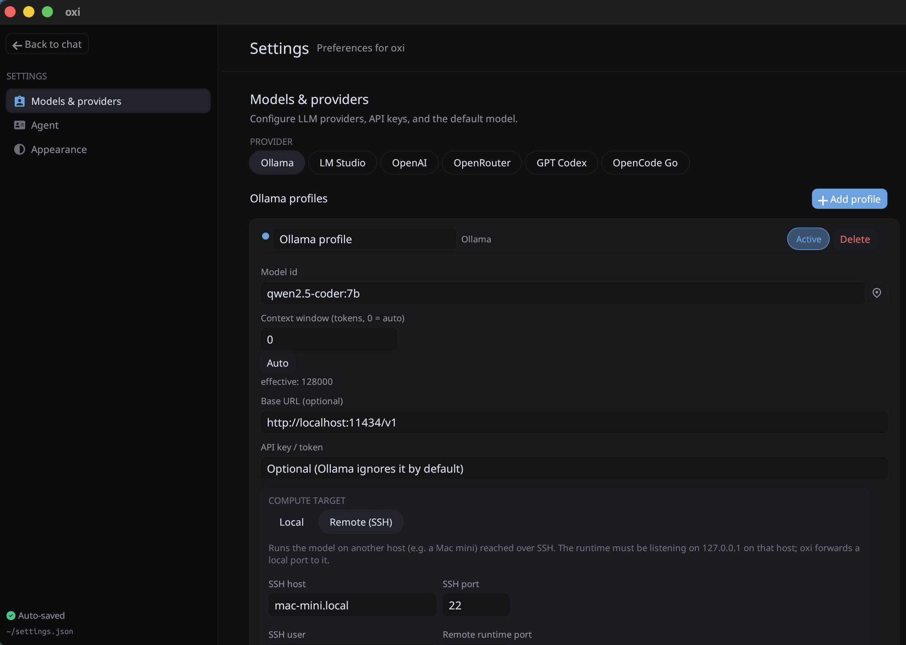

# oxi

[](https://github.com/maziluiosif/oxi/actions/workflows/ci.yml)
[](LICENSE)



`oxi` is a local desktop coding-agent chat app built in Rust with **egui/eframe**.
It runs as a **single native binary** and combines:

- a desktop chat UI
- streaming LLM responses
- built-in workspace tools
- local session persistence per workspace
- configurable provider profiles
- optional OAuth for Codex

The repository builds the native `oxi` desktop app.

## Overview

`oxi` is meant for local coding workflows rather than generic chat.
From the current codebase, it supports:

- multiple **workspaces** in the sidebar
- multiple **chat sessions** per workspace
- a local agent loop that can call built-in tools:
  - `read`
  - `write`
  - `edit`
  - `bash`
  - `grep`
  - `find`
  - `ls`
  - `web_search`
  - `web_fetch`
- streaming assistant output with structured UI blocks
- configurable provider **profiles** with per-profile model and auth settings
- local persistence for settings, OAuth tokens, and chat sessions
- image attachments in chat messages

## Main capabilities

### Workspace-oriented chats

On startup, the app uses the current working directory as the first workspace.
You can add more workspace folders from the UI.

Each workspace has:

- its own list of chat sessions
- its own active session
- tool execution rooted in that workspace directory

Tool calls are executed with the selected workspace as the current directory.

### Multiple sessions per workspace

Sessions are shown in the sidebar and loaded from disk when available.
Current behavior visible in code:

- if no saved sessions exist, the app creates an in-memory `New chat`
- saved sessions are sorted by modification time
- session message bodies are loaded lazily when selected
- session drafts keep per-session composer text and pending images when switching chats
- deleting a session removes its backing `.jsonl` file
- deletion tries the `trash` command first, then falls back to direct file removal

### Local built-in tools

The agent can call these tools when enabled in Settings:

| Tool | Purpose |
|---|---|
| `read` | Read a text file, optionally by line range |
| `write` | Write or overwrite a file, creating parent directories |
| `edit` | Replace exact text in a file |
| `bash` | Run a shell command in the workspace directory |
| `grep` | Search regex text in files under the workspace |
| `find` | Find files matching a glob pattern |
| `ls` | List directory entries |
| `web_search` | Search the web through a configured SearXNG instance |
| `web_fetch` | Fetch a URL and return its content as readable text |

Behavior confirmed in `src/agent/tools/`:

- path-based tools reject paths that escape the workspace root
- `write` can create new files under the workspace
- `edit` requires each `oldText` to match exactly once
- `read` is capped at 2000 lines per call
- `grep` skips `.git`, `target`, and `node_modules`
- `find` also skips `.git`, `target`, and `node_modules`
- `grep`, `find`, and `ls` have result caps
- `web_search` queries the SearXNG JSON API (configure the URL in Settings → Tools; its JSON format must be enabled)
- `web_fetch` only accepts `http://` / `https://` URLs and strips HTML to plain text
- `web_search` and `web_fetch` run as read-only tools (no approval prompt)
- tool output is truncated when too large
- `bash` defaults to a 15s timeout and is capped at 30s
- `bash` blocks only a small deny-list of risky command substrings, not full sandboxing
- `write` and `edit` generate unified diffs for the UI

### Streaming coding UI

Assistant output is rendered as structured blocks rather than plain text only.
From the code and UI modules, the app supports:

- thinking blocks
- grouped tool activity for exploration-style runs
- compact tool pills
- diff rendering for file edits/writes
- markdown final answers
- visible user attachments in the transcript
- stop/cancel while a response is streaming

### Provider profiles

Settings support multiple profiles across multiple providers.
Each profile stores:

- profile id
- display name
- provider kind
- model id
- optional base URL override
- API key / token
- OpenRouter optional headers

The active profile can be switched from:

- the Settings page
- the composer profile dropdown in the main chat UI

Settings are auto-saved when changed.

## Architecture

High-level layout:

- `src/main.rs` — native `eframe` entry point and window setup
- `src/app/` — app state, sidebar, composer, settings page, session/workspace behavior
- `src/agent/` — local agent runner, prompt building, message history conversion, tool execution, provider loops
- `src/oauth/` — OAuth flows and token persistence
- `src/compute/` — SSH tunnels for Remote compute targets and their credential storage
- `src/session_store/` — session loading/saving and storage path handling
- `src/ui/` — transcript and chrome rendering helpers
- `src/settings.rs` — persistent settings and provider profile model

Important runtime behavior from the current implementation:

- the app starts with the current working directory as the initial workspace
- agent runs happen in a background thread with a Tokio runtime
- settings are loaded on startup from the app config directory
- tools are executed locally against the selected workspace root
- the system prompt is expanded at runtime with enabled tools, current date, and working directory
- conversation history is converted to OpenAI-style message JSON before provider requests are sent
- long history is trimmed by an approximate character budget before sending

## Providers

The current code supports these provider kinds:

- **OpenAI**
- **OpenRouter**
- **GPT Codex**
- **OpenCode Go**
- **LM Studio**
- **Ollama**

### OpenAI

Defaults from `src/settings.rs`:

- base URL: `https://api.openai.com/v1`
- default model: `gpt-4o-mini`

Authentication fallback order in code:

- profile API key
- `OPENAI_API_KEY`

### OpenRouter

Defaults:

- base URL: `https://openrouter.ai/api/v1`
- default model: `openai/gpt-4o-mini`

Authentication fallback order:

- profile API key
- `OPENROUTER_API_KEY`

Optional headers supported:

- `HTTP-Referer` from profile field or `OPENROUTER_HTTP_REFERER`
- `X-Title` from profile field or `OPENROUTER_TITLE`

### GPT Codex

Defaults:

- default model: `gpt-4o-mini`
- API-key fallback base URL: `https://api.openai.com/v1`

Two runtime modes exist:

1. **OAuth mode**
   - uses ChatGPT/Codex OAuth
   - uses the Responses-style backend at `https://chatgpt.com/backend-api` unless the profile overrides the base URL
   - sends requests to the Codex responses endpoint under that base URL

2. **API key fallback mode**
   - uses OpenAI-compatible chat completions
   - authenticates with profile API key or `OPENAI_API_KEY`

### OpenCode Go

Defaults:

- base URL: `https://opencode.ai/zen/go`
- default model: `kimi-k2.7-code`

Authentication fallback order:

- profile API key
- `OPENCODE_GO_API_KEY` / `OPENCODE_API_KEY`

Backend selection is model-dependent:

- `minimax-*` / `qwen*` → Anthropic Messages API path
- everything else → chat-completions-style path

### LM Studio

Defaults:

- base URL: `http://localhost:1234/v1` (point this at whichever host runs LM Studio)
- default model: `local-model` (use the profile's "Load available models" button to pick
  whatever is actually loaded)

Authentication:

- LM Studio's local server ignores the bearer token, so an API key is optional. Use the
  profile value or `LMSTUDIO_API_KEY` if set; otherwise an empty key is sent.
- Self-signed TLS certs are accepted for this provider (LAN host behind HTTPS).

### Ollama

Defaults:

- base URL: `http://localhost:11434/v1` (Ollama's OpenAI-compatible API)
- default model: `qwen2.5-coder:7b` (use the profile's "Load available models" button to
  pick whatever is actually pulled)

Authentication:

- Ollama has no auth by default, so an API key is optional. Use the profile value or
  `OLLAMA_API_KEY` if set; otherwise an empty key is sent.
- Self-signed TLS certs are accepted for this provider (LAN host behind HTTPS).

## Compute targets (Local / Remote SSH)



LM Studio and Ollama profiles support a **compute target**, configurable per profile in
Settings → Providers:

- **Local** (default) — connect directly to `effective_base_url()` as before.
- **Remote (SSH)** — run the model on another host (e.g. a machine on your LAN) reached over SSH,
  with the runtime bound to `127.0.0.1` on that host. oxi opens an SSH tunnel and forwards
  a local port to the remote runtime port, so the rest of the app talks to it exactly like
  a local server.

Behavior visible in code (`src/compute/`):

- the SSH client is implemented with `russh` (password authentication; no external `ssh`
  binary required)
- one tunnel is kept alive per profile, reused across agent runs and model-list fetches;
  it (re)connects lazily on first use
- host key verification is intentionally permissive (trust-on-every-connect) — this is a
  convenience tunnel to a host you typed in yourself, not a general-purpose SSH client
- the Settings UI exposes host / SSH port / user / remote runtime port fields plus a
  password field and a **Test connection** button
- SSH passwords are stored in `~/.config/oxi/ssh_credentials.json`, keyed by profile id —
  **not** in `settings.json` — so they aren't dragged along whenever settings are read,
  logged, or exported (same plaintext-JSON trust model as `oauth.json`)

## OAuth flows

### ChatGPT / Codex OAuth

Implemented via PKCE.

Behavior visible in code:

- the app opens the browser for login
- it listens on `http://localhost:1455/auth/callback`
- access and refresh tokens are stored in `oauth.json`
- the access token is refreshed automatically before expiry
- the callback port `1455` must be available

## Attachments

The UI supports image attachments through:

- file picker
- drag and drop
- paste from clipboard

Supported image formats in code:

- PNG
- JPEG
- GIF
- WebP

Attachment limits are enforced in the UI layer:

- max image count per message
- max bytes per image

Important note about provider payloads:

- user image attachments are stored in messages and rendered in the transcript
- they are converted into OpenAI-style `image_url` content blocks when history is prepared
- actual provider compatibility still depends on the selected backend/model

## Settings and configuration

Settings are stored at:

- `~/.config/oxi/settings.json` on systems where `dirs::config_dir()` resolves there
- or the platform-equivalent config directory

OAuth tokens are stored separately at:

- `~/.config/oxi/oauth.json`

SSH passwords for Remote compute targets are stored separately at:

- `~/.config/oxi/ssh_credentials.json`

The settings model currently contains:

- active profile id
- provider profiles
- system prompt template
- tool enable/disable flags

The settings UI allows:

- adding/removing profiles
- selecting the active profile
- editing model id, base URL, and API key/token
- editing OpenRouter headers
- enabling/disabling tools
- launching OAuth sign-in and sign-out
- editing the system prompt
- saving settings automatically to disk

## Sessions and local data

Chat sessions are persisted as `.jsonl` files.

Behavior visible in the session store:

- sessions are loaded per workspace
- titles are derived from session metadata or the first user message
- duplicate trailing history can be deduplicated before save/load flows
- assistant blocks and attachments are preserved in session serialization
- saved sessions initially load as headers-only rows and full messages are read lazily when opened

## Build and run

### Requirements

- Rust toolchain
- desktop environment supported by `eframe`

### Run

```bash
cargo run --release
```

Binary output:

```bash
target/release/oxi
```

## Environment variables

| Purpose | Variable(s) |
|---|---|
| OpenAI auth | `OPENAI_API_KEY` |
| OpenRouter auth | `OPENROUTER_API_KEY` |
| OpenRouter referer | `OPENROUTER_HTTP_REFERER` |
| OpenRouter title | `OPENROUTER_TITLE` |
| Codex fallback auth | `OPENAI_API_KEY` |
| OpenCode Go auth | `OPENCODE_GO_API_KEY`, `OPENCODE_API_KEY` |
| LM Studio auth (optional) | `LMSTUDIO_API_KEY` |
| Ollama auth (optional) | `OLLAMA_API_KEY` |

## System prompt behavior

The app stores one editable system prompt template.

Supported placeholder:

- `{tools_list}` — replaced with the enabled tool names

At runtime, the prompt builder also appends:

- current date
- current working directory

Default prompt guidance includes:

- prefer reading files before editing
- keep shell commands safe and relevant
- do not guess when the codebase can be inspected
- verify claims from source files before answering

## Current limitations and safety notes

Based on the current source code:

- `bash` safety checks are basic and not a real sandbox
- tool execution can modify files inside the selected workspace
- provider API keys (`settings.json`), OAuth tokens (`oauth.json`), and SSH passwords for
  Remote compute targets (`ssh_credentials.json`) are all stored as plaintext JSON on disk,
  not in an OS keychain. On Unix these files are written with `0600` permissions (owner-only)
  as a baseline protection against other local accounts; there is no protection against
  another process running as the same user, and no such restriction is applied on Windows
- Remote SSH tunnels trust the remote host key on every connection (no pinning/known_hosts
  verification) — only point this at hosts you control
- workspace path protections apply to file-based tools, but you should still use the app on trusted repositories
- long conversations are trimmed heuristically by character budget, not exact tokenizer counts
- image support in provider requests depends on backend/model compatibility

## Useful source files

- `src/agent/tools/mod.rs` — built-in tool dispatch and shared limits
- `src/agent/tools/file_ops.rs` — `read` / `write` / `edit` and diff generation
- `src/agent/tools/shell_search.rs` — `bash` / `grep` / `find` / `ls`
- `src/agent/tools/web.rs` — `web_search` (SearXNG) / `web_fetch` (URL → text)
- `src/agent/runner.rs` — provider selection, auth fallback, and run orchestration
- `src/agent/history.rs` — conversation-to-provider message conversion and context trimming
- `src/agent/prompt.rs` — system prompt construction
- `src/settings.rs` — settings and provider profile model
- `src/app/settings_ui.rs` — settings UI
- `src/app/sessions.rs` — workspaces, attachments, and session deletion behavior
- `src/session_store.rs` — session persistence entry points
- `src/compute/tunnel.rs` — SSH tunnel manager (`russh`) for Remote compute targets
- `src/compute/store.rs` — SSH credential storage (`ssh_credentials.json`)

## License

MIT
