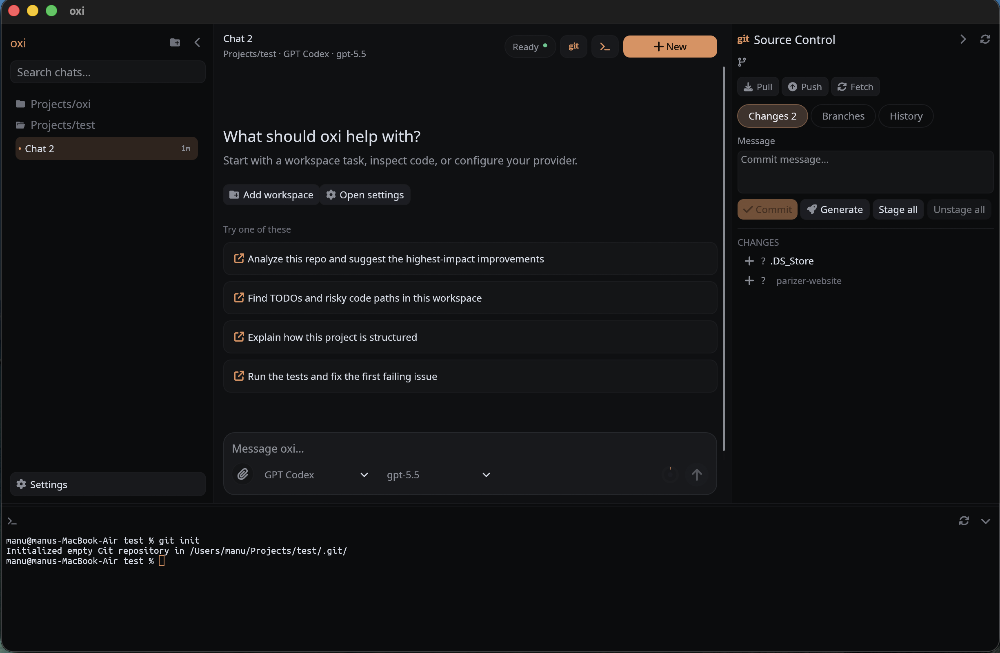
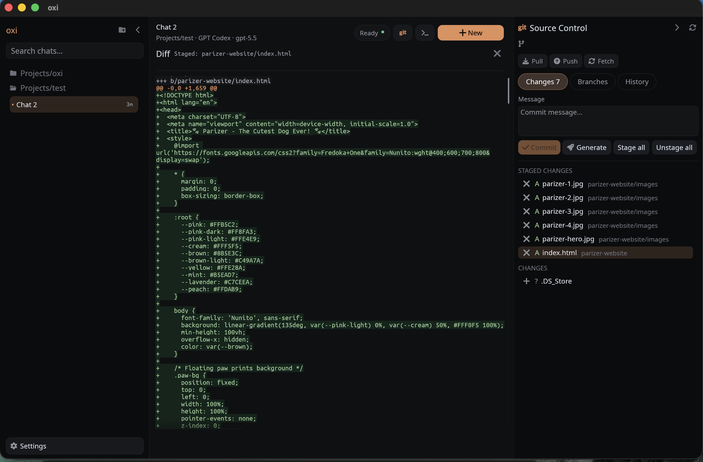
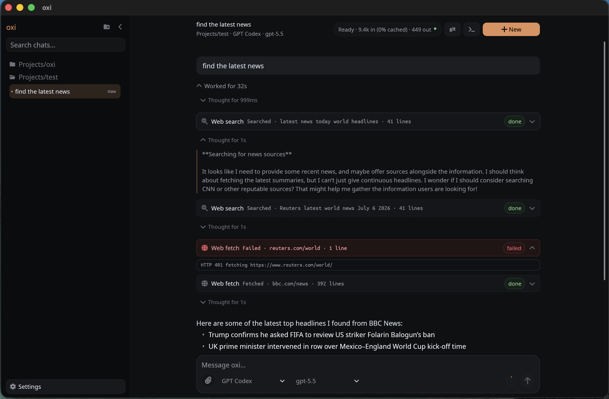
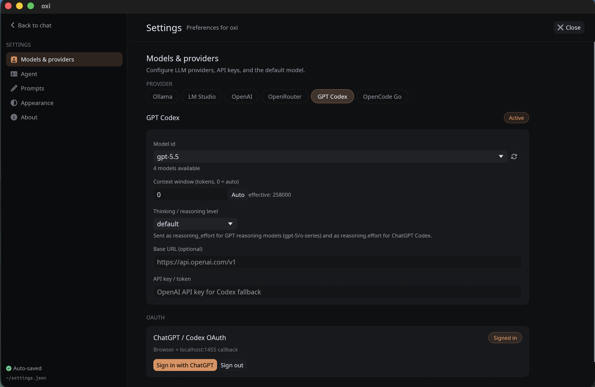
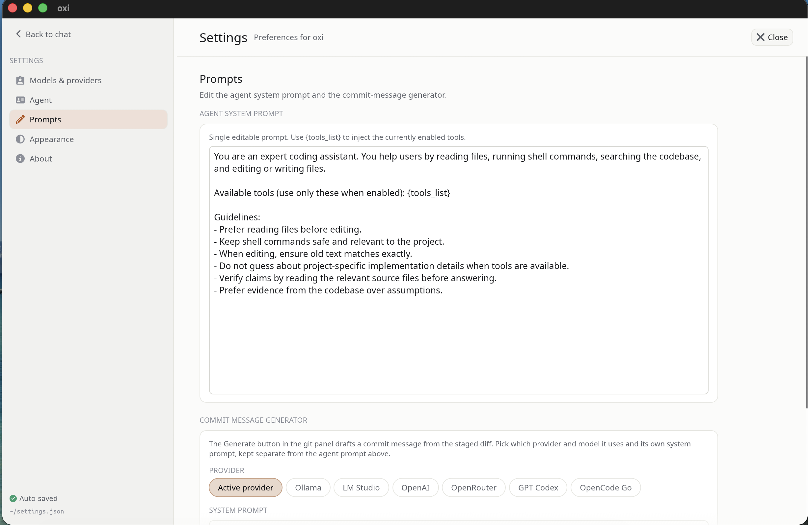
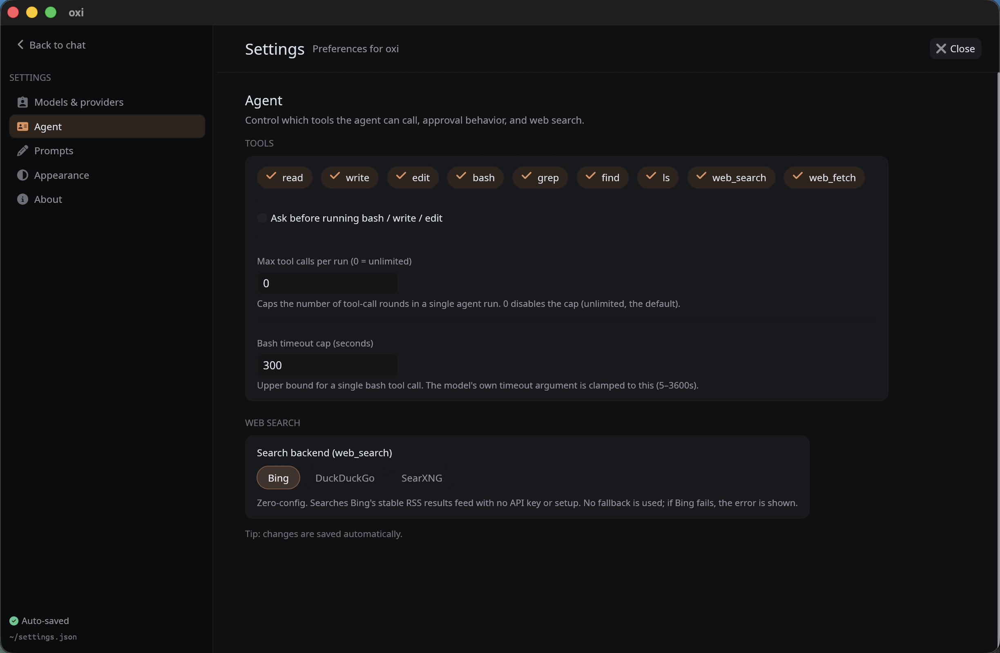
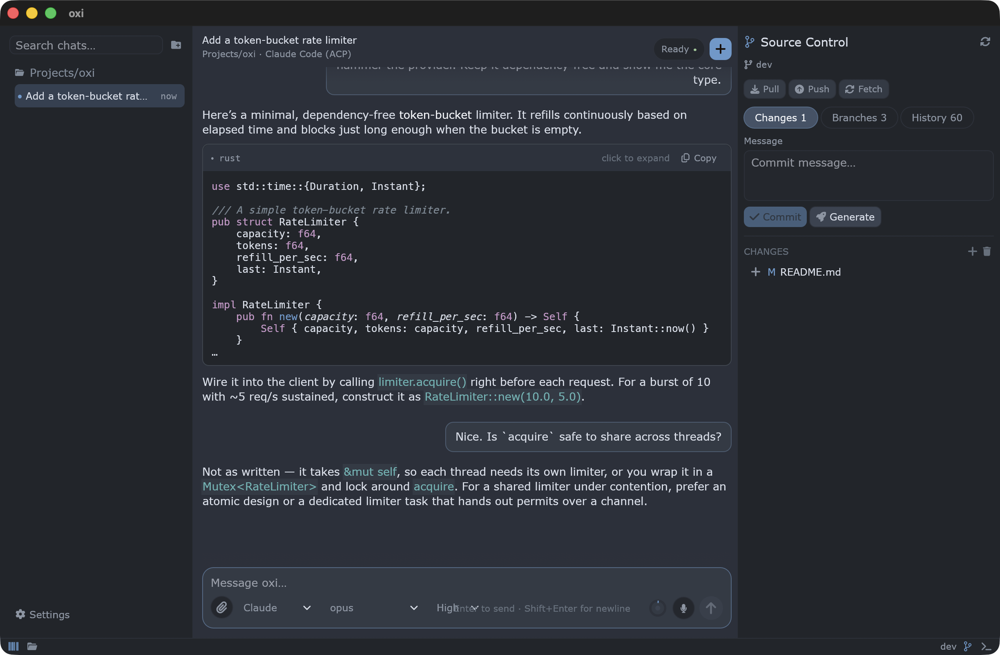
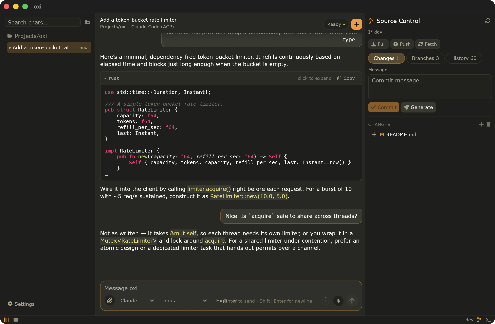
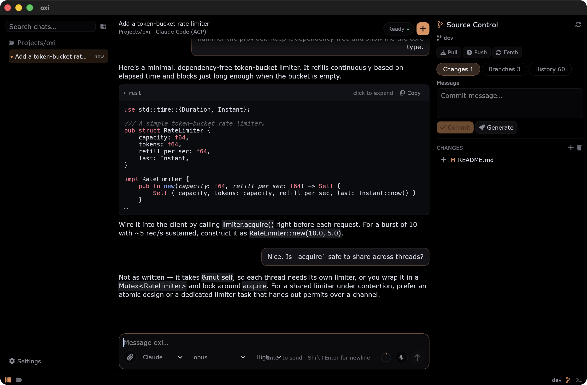
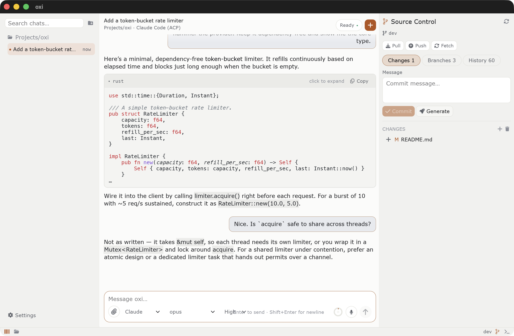

[](https://github.com/maziluiosif/oxi/actions/workflows/ci.yml)
[](LICENSE)
[](https://maziluiosif.github.io/oxi/)

**Website: [maziluiosif.github.io/oxi](https://maziluiosif.github.io/oxi/)** · [Download](https://github.com/maziluiosif/oxi/releases)

**oxi** is a native, local-first coding-agent desktop app for people who want to run *any* model — your own local GGUF, an Ollama/LM Studio server, a box you SSH into, or a hosted API — without an Electron shell and without your code, keys, or history leaving your machine.

It is a single native binary built in Rust with **egui/eframe**: a chat-driven coding agent, a workspace file explorer and multi-tab code editor, local workspace tools, session persistence, Git controls, an embedded terminal, and local voice dictation — all rooted in your own directories.

**Why it exists:** the polished commercial coding tools assume you'll use their cloud and their subscription model. oxi is the opposite bet — bring your own model, keep everything local, own your data. If you run local or self-hosted models, care about privacy, or just don't want a browser engine eating your RAM, oxi is built for you.

The default workflow is coding-agent oriented, but the system prompt is editable, so oxi can be adapted to other assistant workflows too.


## Install

### Homebrew (macOS Apple Silicon, Linux x86_64)

```bash
brew tap maziluiosif/tap
brew install oxi
```

The Homebrew formula installs the precompiled binary from the latest GitHub release and is updated automatically on every release. On macOS the `.app` bundle is kept inside the Homebrew prefix; the `oxi` command launches it from any directory, using that directory as the first workspace.

### Manual download

Precompiled archives for macOS (arm64), Linux (x86_64), and Windows (x86_64) are attached to each [GitHub release](https://github.com/maziluiosif/oxi/releases).

#### macOS Gatekeeper / quarantine note

If you download the macOS binary or `.app` manually, macOS may block it because it came from the internet. Remove the quarantine attribute after extracting it:

```bash
# For an app bundle:
xattr -dr com.apple.quarantine /path/to/oxi.app

# Or for a standalone binary:
xattr -d com.apple.quarantine /path/to/oxi
```

Then launch it normally.

### Build and run from source

Requirements:

- Rust toolchain compatible with the crate's `rust-version` in `Cargo.toml`
- desktop environment supported by `eframe`
- native C/C++ build tools required by the local Whisper voice-dictation dependency

#### Windows prerequisites

Install LLVM/libclang and CMake from PowerShell:

```powershell
winget install --id LLVM.LLVM -e
winget install --id Kitware.CMake -e
```

You also need Visual Studio Build Tools with the **Desktop development with C++** workload (MSVC and a Windows SDK). After installing these dependencies, open a new terminal and verify them:

```powershell
cmake --version
Test-Path "C:\Program Files\LLVM\bin\libclang.dll"
```

If the second command returns `True` but the build cannot find `libclang`, configure its location permanently and for the current terminal:

```powershell
[Environment]::SetEnvironmentVariable("LIBCLANG_PATH", "C:\Program Files\LLVM\bin", "User")
$env:LIBCLANG_PATH = "C:\Program Files\LLVM\bin"
```

Then build and run the application:

```bash
cargo run --release
```

Binary output:

```bash
target/release/oxi
```

## Why oxi

- **Any model, no lock-in** — hosted APIs (OpenAI, Azure, OpenRouter, GPT Codex, OpenCode Go, Anthropic-compatible), local servers (LM Studio, Ollama), oxi-managed HuggingFace GGUF models via `llama-server`, or agent CLIs over ACP (Claude Code, Cursor, Codex). Switch providers from one control.
- **Local-first by design** — settings, sessions, tool execution, SSH credentials, OAuth tokens, local models, and voice models stay on your machine. No account required to use your own models.
- **Local & self-hosted friendly** — run GGUF models oxi downloads for you, connect to an LM Studio/Ollama server, or tunnel to a GPU box over SSH — no external `ssh` binary needed.
- **Native, not Electron** — Rust + egui, a single binary, no bundled browser engine. Low idle RAM (see below).
- **Workspace file explorer + code editor** — a multi-tab editor with syntax highlighting, minimap, find/replace, external-change detection, and Git changes opened inline — not just a chat window.
- **Workspace-aware agent tools** — inspect and search code, read/write/edit/delete/move files, create directories, inspect Git state/diffs, run verification commands, call MCP servers, and search/fetch web content.
- **Built-in developer surfaces** — source-control panel, diffs, commit-message generation, and a workspace-rooted terminal.
- **User-controlled prompting** — editable agent prompt, `@`-mention files/folders into a message, and a separate commit-message prompt.
- **Local voice dictation** — optional microphone dictation using local Whisper models.


## Screenshots

| Git and terminal | Diff view |
|---|---|
|  |  |

| Coding flow | Provider settings |
|---|---|
|  |  |

| Editable system prompt | Tools/settings |
|---|---|
|  |  |

## Main capabilities

### Workspace-oriented chats

On startup, oxi uses the current working directory as the first workspace. Additional workspace folders can be added from the UI and are persisted in settings.

Each workspace has:

- its own chat sessions
- its own active/new chat state
- its own composer draft and pending image attachments
- local tool execution rooted in that workspace directory
- Git and terminal operations rooted in that workspace when selected

### Sessions and local history

Chat sessions are persisted as `.jsonl` files per workspace. Saved sessions are shown in the sidebar, sorted by modification time, and loaded lazily when opened.

Session storage preserves:

- user/assistant messages
- structured assistant blocks
- thinking text
- tool calls and tool output
- diffs from file operations
- image attachments
- generated session metadata such as titles

If no saved sessions exist, oxi starts with an in-memory `New chat`.

### Local built-in tools

The agent can call these tools when enabled in Settings:

| Tool | Purpose |
|---|---|
| `read` | Read a text file, optionally by line range |
| `write` | Write or overwrite a file, creating parent directories |
| `edit` | Replace exact text in a file |
| `delete` | Delete a file or an empty directory |
| `move` | Move or rename a file or empty directory |
| `mkdir` | Create one directory whose parent already exists |
| `bash` | Run a non-mutating verification command in the workspace directory |
| `grep` | Search regex text in files under the workspace |
| `find` | Find files matching a glob pattern |
| `ls` | List directory entries |
| `codebase_search` | Rank code and matching lines for a natural-language query |
| `git_status` | Show the workspace's staged, unstaged, and untracked changes |
| `git_diff` | Show staged/unstaged or revision-based Git diffs |
| `web_search` | Search the web through Bing RSS, DuckDuckGo, or a configured SearXNG instance |
| `web_fetch` | Fetch a URL and return readable text |
| `mcp_<server>_<tool>` | Call tools exposed by enabled stdio MCP servers |

Tool behavior:

- path-based tools reject paths that escape the workspace root
- `write` can create new files under the workspace
- `edit` requires each `oldText` to match exactly once unless `replaceAll` is set
- `delete` is non-recursive, while `move` refuses to overwrite destinations and `mkdir` creates one level at a time
- built-in filesystem mutations are journaled per turn so **Edit & retry** can restore them when no conflicting user change occurred
- `read` is capped per call
- `grep` / `find` skip common large folders such as `.git`, `target`, and `node_modules`
- `grep`, `find`, and `ls` have result caps
- `web_fetch` only accepts `http://` / `https://` URLs and strips HTML to plain text
- web tools are read-only and do not require approval
- filesystem mutations (`write`, `edit`, `delete`, `move`, `mkdir`) and `bash` can require explicit approval, controlled separately in Settings
- MCP tools always require approval because their side effects are not known in advance
- `write` and `edit` generate unified diffs for the UI
- `bash` has a configurable timeout cap, defaulting to 300 seconds
- `bash` includes a small deny-list for obviously risky command substrings, but this is not a sandbox; the approval prompt is the real safety boundary

### Streaming coding UI

Assistant output is rendered as structured blocks rather than plain text only. The app supports:

- streaming responses
- thinking blocks
- grouped tool activity for exploration-style runs
- compact tool pills
- diff rendering for file writes/edits
- markdown final answers
- image attachments in the transcript
- stop/cancel while a response is streaming
- `@`-mention files and folders in the composer to inject their contents into the message
- unseen-completion flagging when an agent run finishes in a chat you are not currently viewing
- heuristic long-history trimming before provider requests

### Git panel

oxi includes a right-side source-control panel backed by the `git` CLI. The worker runs in the selected workspace and updates the UI without blocking it.

Current Git features include:

- status for staged and unstaged changes
- branch list and checkout
- new branch creation
- commit history
- per-file and per-commit diff viewing
- stage / unstage / discard
- commit
- fetch / pull / push
- AI commit-message generation from the current diff

The commit-message generator can use the active provider or a provider/model pinned in Settings, with its own editable system prompt.

### File explorer and code editor

oxi is more than a chat window: it includes a workspace file explorer and a multi-tab text editor so you can read and edit code next to the agent.

- **Explorer tree** — browse the active workspace, with Git status coloring on entries and dimming for Git-ignored paths.
- **Context-menu file operations** — create, rename, and delete files/folders from the tree, and reveal a path in the OS file manager.
- **Multi-tab editor** — open several files at once, each in its own tab, with syntax highlighting.
- **Minimap** — a scrollable overview of the current file; you can scroll while hovering over it.
- **Find / replace** — in-file search and replace with match highlighting.
- **External-change detection** — oxi notices when a file changes on disk (e.g. after an agent edit) and keeps the view in sync.
- **Git changes inline** — open a Git diff as an editor tab, with files staying open and editable beside it.

### Embedded terminal

A bottom terminal panel hosts a live PTY shell rooted at the active workspace. It is resizable, hideable, persisted in settings, and can be restarted from the panel header.

### Voice dictation

Voice dictation is optional and fully local:

- microphone capture uses `cpal`
- transcription uses `whisper-rs` / whisper.cpp bindings
- voice models are downloaded from `ggerganov/whisper.cpp` on HuggingFace
- available model sizes range from Tiny to Large v3, including English-only and multilingual variants
- the Whisper model is loaded lazily only when transcribing
- by default, the model is unloaded after each transcription so idle dictation does not keep extra memory resident
- language can be set explicitly or left as `auto`

## Providers

Settings keep one configuration per provider kind. The active provider can be switched from Settings or from the composer provider control.

Supported provider kinds:

| Provider | Notes |
|---|---|
| OpenAI | OpenAI-compatible chat completions |
| Azure OpenAI | Azure deployment endpoint style |
| OpenRouter | OpenRouter chat completions with optional referer/title headers |
| GPT Codex | ChatGPT/Codex OAuth mode or OpenAI API-key fallback |
| OpenCode Go | OpenCode Go subscription endpoint; backend shape depends on model family |
| Custom Anthropic | User-configured Anthropic Messages-compatible endpoint |
| LM Studio | Local/LAN OpenAI-compatible server |
| Ollama | Local/LAN OpenAI-compatible server at `/v1` |
| Local HF | oxi-managed GGUF model + local `llama-server` runtime |
| Remote HF | oxi-managed GGUF model + `llama-server` runtime on an SSH-tunneled host |
| Claude Code (ACP) | oxi acts as an Agent Client Protocol client and spawns the `claude-code-acp` subprocess |
| Cursor (ACP) | Cursor CLI's built-in ACP server (`agent acp`) |
| Codex (ACP) | OpenAI Codex CLI through the official ACP adapter |

### Provider defaults

| Provider | Default base URL | Default model |
|---|---|---|
| OpenAI | `https://api.openai.com/v1` | `gpt-4o-mini` |
| Azure OpenAI | `https://YOUR_RESOURCE.openai.azure.com/openai/deployments/YOUR_DEPLOYMENT` | `gpt-4o-mini` |
| OpenRouter | `https://openrouter.ai/api/v1` | `openai/gpt-4o-mini` |
| GPT Codex | `https://api.openai.com/v1` for API-key fallback | `gpt-4o-mini` |
| OpenCode Go | `https://opencode.ai/zen/go` | `kimi-k2.7-code` |
| Custom Anthropic | `http://localhost:8000` | `claude-sonnet-4-5` |
| LM Studio | `http://localhost:1234/v1` | `local-model` |
| Ollama | `http://localhost:11434/v1` | `qwen2.5-coder:7b` |
| Local HF | `http://127.0.0.1:18080/v1` | `local-hf-model` |
| Remote HF | `http://127.0.0.1:18080/v1` (via SSH tunnel) | `local-hf-model` |
| Claude Code (ACP) | not HTTP-based | `sonnet` informational default |
| Cursor (ACP) | not HTTP-based | provider default |
| Codex (ACP) | not HTTP-based | provider default |

### Auth fallback environment variables

| Purpose | Variable(s) |
|---|---|
| OpenAI auth | `OPENAI_API_KEY` |
| Azure OpenAI auth | `AZURE_OPENAI_API_KEY` |
| OpenRouter auth | `OPENROUTER_API_KEY` |
| OpenRouter referer | `OPENROUTER_HTTP_REFERER` |
| OpenRouter title | `OPENROUTER_TITLE` |
| Codex API-key fallback auth | `OPENAI_API_KEY` |
| OpenCode Go auth | `OPENCODE_GO_API_KEY`, `OPENCODE_API_KEY` |
| Custom Anthropic auth | `CUSTOM_ANTHROPIC_API_KEY`, `ANTHROPIC_API_KEY` |
| LM Studio auth, optional | `LMSTUDIO_API_KEY` |
| Ollama auth, optional | `OLLAMA_API_KEY` |

API keys saved through the UI are stored in the OS credential store, not in `settings.json`.

## Local and remote models

### LM Studio and Ollama

Create an LM Studio or Ollama provider config, point the base URL at your runtime, and use **Load available models** in the UI to choose a model that is actually loaded/pulled.

LM Studio and Ollama API keys are optional because local servers usually ignore bearer tokens. oxi will use the profile value, then the relevant environment variable, then an empty key.

### Local HF and Remote HF

The **Local HF** and **Remote HF** providers let oxi manage GGUF models directly:

- search HuggingFace for GGUF repositories
- list available `.gguf` files
- download selected models into oxi's data directory
- install a matching `llama-server` runtime
- start/stop the `llama-server` process
- talk to it through the OpenAI-compatible `/v1` API

The two providers differ only in *where* the managed runtime runs:

- **Local HF** runs the oxi-managed `llama-server` on this machine.
- **Remote HF** runs the same oxi-managed workflow — install runtime, download GGUF, start/stop, tunnel chat — on another host over SSH. It is always remote; there is no local/remote toggle.

Remote HF is a dedicated provider now. If you previously configured **Local HF** with an SSH compute target, oxi migrates that setup to **Remote HF** automatically on first launch.

### Remote compute over SSH


SSH compute targets connect oxi to a model runtime on another machine through an SSH tunnel:

- **LM Studio and Ollama** expose a **Local / Remote (SSH)** toggle. *Local* connects directly to the provider's base URL; *Remote (SSH)* forwards a local port to a runtime already listening on `127.0.0.1` on the remote host.
- **Remote HF** is SSH-only and additionally manages the runtime for you (install, download, start/stop) on the remote host.

Implementation notes:

- SSH uses `russh`; no external `ssh` binary is required
- password authentication is supported
- one tunnel is reused per provider and reconnects lazily
- SSH passwords are stored in the OS keychain
- host keys use trust-on-first-use pinning; a changed key is rejected until accepted/reset by the user
- the Settings UI exposes host, SSH port, user, remote runtime port, password, and connection testing

## OAuth flows

### ChatGPT / Codex OAuth

GPT Codex supports a PKCE OAuth flow:

- oxi opens the browser for login
- it listens on `http://localhost:1455/auth/callback`
- access and refresh tokens are stored in the OS credential store
- access tokens are refreshed automatically before expiry
- callback port `1455` must be available

If OAuth is not used, GPT Codex can fall back to OpenAI-compatible chat completions with an API key.

## Attachments

The UI supports image attachments through:

- file picker
- drag and drop
- paste from clipboard

Supported image formats:

- PNG
- JPEG
- GIF
- WebP

Images are stored in session history and rendered in the transcript. They are converted to OpenAI-style `image_url` blocks when history is prepared, but actual compatibility depends on the selected provider/model.

## Settings and local data

Settings are stored under the platform config directory, for example:

- `~/.config/oxi/settings.json` on many Linux systems
- the platform-equivalent config directory on macOS and Windows

Secrets are not stored in `settings.json`:

- provider API keys
- OAuth tokens
- SSH passwords

They are stored in the OS credential store:

- macOS Keychain
- Windows Credential Manager
- Secret Service over D-Bus on Linux

Other local data includes:

- chat sessions per workspace
- downloaded Local HF models and runtime files
- downloaded Whisper voice models
- local manifests for downloaded models
- optional crash log at `<config_dir>/oxi/crash.log`

On Unix, `settings.json` is written with `0600` permissions as defense in depth for non-secret configuration.

## System prompts

oxi stores an editable main agent system prompt.

Supported placeholder:

- `{tools_list}` — replaced with the enabled tool names

At runtime, the prompt builder also appends:

- root-level `AGENTS.md` project instructions, when present and enabled in Settings
- current date
- current working directory

`AGENTS.md` loading is intentionally simple: oxi reads only `<workspace>/AGENTS.md`, caps it at 64 KiB, and labels it clearly as project instructions in the system prompt.

There is also a separate editable system prompt for AI commit-message generation.

## Web search

The `web_search` tool supports multiple backends:

- **Bing** — default zero-config backend using RSS results
- **DuckDuckGo** — optional backend
- **SearXNG** — user-configured instance URL; JSON support must be available

`web_fetch` is separate and can fetch readable text from HTTP(S) URLs.

## Appearance

Settings include theme and density controls. Built-in themes are managed by the theme catalog, and UI density is applied through egui zoom so text and spacing scale together. A custom theme can also be loaded from a JSON spec.

Built-in themes: **Dark**, **Light**, **Midnight**, **Sublime**, and **Sublime 4** (`mariana`). Each theme restyles the whole app — chrome, transcript, syntax highlighting, and the editor — consistently.

| Sublime 4 | Sublime |
|---|---|
|  |  |

| Midnight | Light |
|---|---|
|  |  |

## Architecture

High-level source layout:

- `src/main.rs` — native `eframe` entry point, window setup, panic logging
- `src/app/` — app state, sidebar, composer, settings page, session/workspace behavior, Git/terminal panels
- `src/app/file_explorer/` — workspace file explorer, multi-tab code editor, minimap, find/replace, and inline Git-diff tabs
- `src/agent/` — agent runner, prompts, provider adapters, history conversion/trimming, approvals, tool execution
- `src/agent/tools/` — filesystem, shell/search, codebase-search, Git inspection, web, and reversible-turn tool implementations
- `src/git.rs` — background Git worker and typed Git operations
- `src/terminal.rs` — PTY terminal session
- `src/local_models.rs` — HuggingFace GGUF downloads and local `llama-server` runtime management
- `src/local_models_remote.rs` — remote SSH helpers for Local HF
- `src/voice_engine.rs` — local microphone capture and Whisper transcription
- `src/voice_models.rs` — Whisper model catalog/downloads
- `src/oauth/` — Codex OAuth and token persistence
- `src/compute/` — SSH tunnels and credential storage
- `src/session_store/` — session loading/saving and storage path handling
- `src/settings/` — persistent settings and provider config model
- `src/theme/` — theme catalog, palette, formatting, and style helpers
- `src/ui/` — shared UI chrome helpers

Important runtime behavior:

- the current working directory becomes the initial workspace
- agent runs happen off the UI thread with a Tokio runtime
- Git operations run on a background worker thread
- the terminal is spawned lazily when the panel opens
- voice transcription runs on its own background thread
- settings are loaded on startup and saved through the Settings page or relevant toggles
- tools execute locally against the selected workspace root
- conversation history is converted to provider-specific payloads before requests are sent

## Current limitations and safety notes

- `bash` safety checks are best-effort and not a sandbox
- built-in filesystem tools can modify files inside the selected workspace; MCP tools and `bash` may have broader side effects and are not sandboxed
- Git panel actions can modify the repository, including discard/commit/checkout/pull/push
- Remote SSH tunnels should only be pointed at hosts you control
- long conversation trimming uses approximate budgets, not exact tokenizer accounting
- image input support depends on backend/model compatibility
- Local HF runtime support depends on the platform/runtime artifacts available for `llama.cpp`
- voice dictation requires a usable microphone input device and a downloaded Whisper model

## Development checks

The CI workflow runs:

```bash
cargo fmt --all -- --check
cargo clippy --all-targets -- -D warnings
cargo audit
cargo test
```
