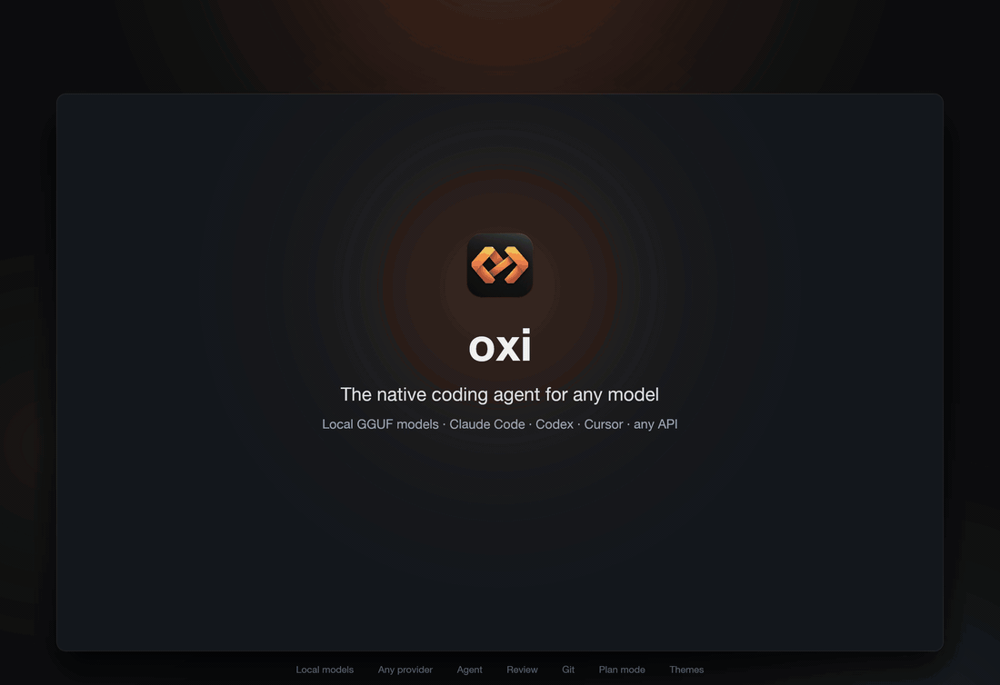
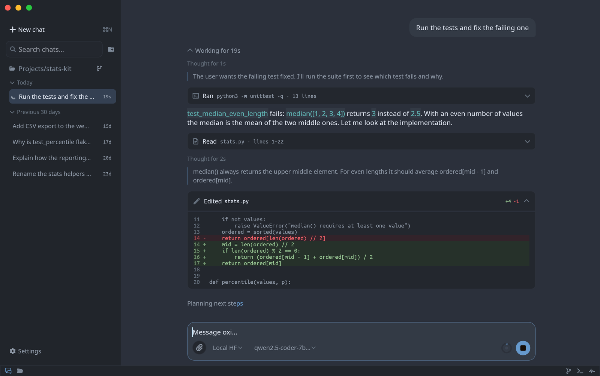
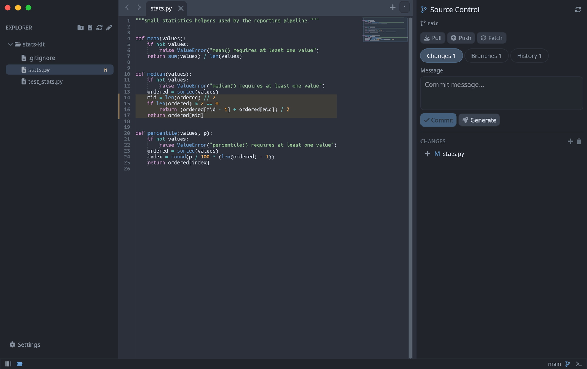
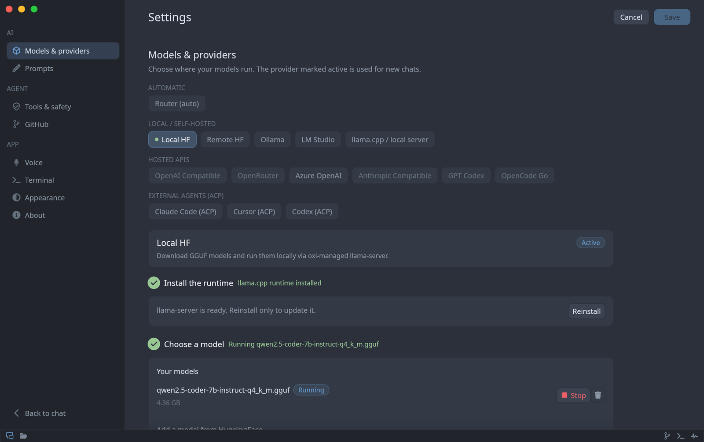
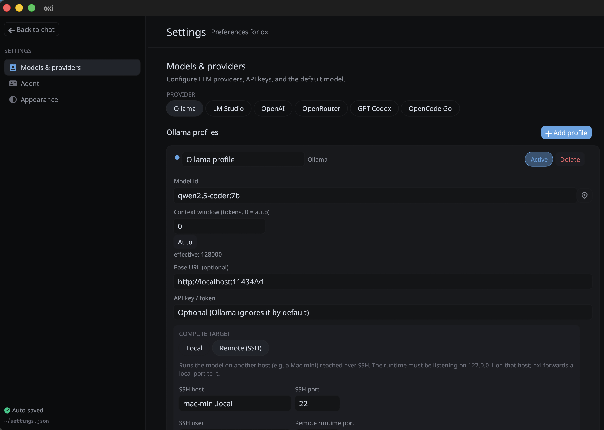
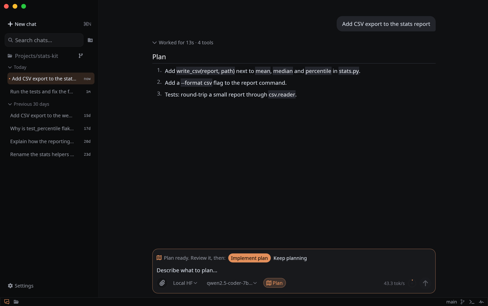

[](https://github.com/maziluiosif/oxi/actions/workflows/ci.yml)
[](LICENSE)
[](https://maziluiosif.github.io/oxi/)

# oxi

A native, local-first coding agent. One Rust binary, no Electron, ~110 MB idle.

- **Run models locally:** pick a GGUF from HuggingFace and oxi downloads it, installs `llama-server` and runs it, on this machine or on a GPU box over SSH. LM Studio and Ollama work too.
- **Or use what you already pay for:** Claude Code, Cursor and Codex CLI over ACP, ChatGPT/Codex sign-in, or any hosted API.
- **A real workspace:** file explorer, code editor, Git panel and terminal next to the chat.
- **No extra keys:** web search through DuckDuckGo, Bing or your own SearXNG, and local Whisper voice dictation.



## Install

**macOS (Apple Silicon) and Linux (x86_64):**

```bash
curl -fsSL https://maziluiosif.github.io/oxi/install.sh | sh
```

**Windows (x86_64), in PowerShell:**

```powershell
irm https://maziluiosif.github.io/oxi/install.ps1 | iex
```

To update, run `oxi update` (or `oxi update v1.8.0` for a specific release), or the same install command again. Then start oxi from your apps menu, or run `oxi` inside a project folder to open it as your workspace.

<details>
<summary>Other ways to install</summary>

### Homebrew (macOS, Linux)

```bash
brew tap maziluiosif/tap
brew install --cask oxi
xattr -cr /Applications/oxi.app   # macOS only, once after installing
```

### Manual download

Get the archive for your platform from [Releases](https://github.com/maziluiosif/oxi/releases) and extract it. On macOS, move `oxi.app` to `/Applications` and run `xattr -cr /Applications/oxi.app` once, because the app is not notarized by Apple. On Windows, click **More info → Run anyway** the first time.

### Install options

The install scripts accept a few environment variables:

| Variable | Effect |
|---|---|
| `OXI_VERSION` | Install a specific release, e.g. `v1.8.0` |
| `OXI_BIN_DIR` | macOS/Linux: where the `oxi` command goes (default `~/.local/bin`) |
| `OXI_APP_DIR` | macOS: where `oxi.app` goes (default `/Applications`) |
| `OXI_INSTALL_DIR` | Windows: install folder (default `%LOCALAPPDATA%\Programs\oxi`) |

</details>

<details>
<summary>Build from source</summary>

You need **Rust 1.92+** ([rustup](https://rustup.rs)) and C/C++ build tools.

```bash
git clone https://github.com/maziluiosif/oxi
cd oxi
cargo run --release
```

#### Windows prerequisites

```powershell
winget install --id LLVM.LLVM -e
winget install --id Kitware.CMake -e
```

Also install Visual Studio Build Tools with the **Desktop development with C++** workload. If the build can't find `libclang`, set:

```powershell
[Environment]::SetEnvironmentVariable("LIBCLANG_PATH", "C:\Program Files\LLVM\bin", "User")
```

</details>

## What it does



- **Agent with workspace tools:** reads, searches and edits code, runs checks, looks at Git diffs, searches the web and calls your MCP servers. File changes and shell commands can ask for approval first.
- **Plan mode:** type `/plan` to let the agent investigate without changing anything, then click **Implement plan**.
- **Editor:** multiple tabs, syntax highlighting, minimap, find and replace, Git changes inline.
- **Git panel:** stage, commit, branch, pull and push, with AI commit messages.
- **Terminal:** a shell rooted in your workspace.
- **Sessions:** chats are saved per workspace and stay on your machine.
- **Voice dictation:** local Whisper, nothing leaves your computer.
- **Themes:** Dark, Light, Midnight, Sublime and Sublime 4.

| Review in the editor | Local models |
|---|---|
|  |  |

| Remote compute over SSH | Dark theme |
|---|---|
|  |  |

## Models and providers

Pick a provider in Settings or from the model picker in the composer.

| Provider | |
|---|---|
| **Local HF** | oxi downloads a GGUF and runs `llama-server` for you |
| **Remote HF** | Same, on another machine over SSH |
| **LM Studio, Ollama, llama.cpp** | Your own local or LAN server, optionally over SSH |
| **Claude Code, Cursor, Codex** | Uses your existing subscription through ACP |
| **GPT Codex** | Sign in with ChatGPT, or use an OpenAI key |
| **OpenAI, Azure, OpenRouter, OpenCode Go, Anthropic-compatible** | Hosted APIs with your key |
| **Router** | Picks one of your providers per task, and switches if one runs out of quota |

With Router you can also just say it in the chat: *"use Codex for this"* or *"from now on use Claude Code"*.

<details>
<summary>Default URLs and environment variables</summary>

| Provider | Default base URL | Key from environment |
|---|---|---|
| OpenAI | `https://api.openai.com/v1` | `OPENAI_API_KEY` |
| Azure OpenAI | `https://YOUR_RESOURCE.openai.azure.com/openai/deployments/YOUR_DEPLOYMENT` | `AZURE_OPENAI_API_KEY` |
| OpenRouter | `https://openrouter.ai/api/v1` | `OPENROUTER_API_KEY` |
| GPT Codex | OAuth, or `https://api.openai.com/v1` with a key | `OPENAI_API_KEY` |
| OpenCode Go | `https://opencode.ai/zen/go` | `OPENCODE_GO_API_KEY`, `OPENCODE_API_KEY` |
| Custom Anthropic | `http://localhost:8000` | `CUSTOM_ANTHROPIC_API_KEY`, `ANTHROPIC_API_KEY` |
| LM Studio | `http://localhost:1234/v1` | `LMSTUDIO_API_KEY` (optional) |
| llama.cpp | `http://localhost:8080/v1` | `LLAMA_API_KEY` (optional) |
| Ollama | `http://localhost:11434/v1` | `OLLAMA_API_KEY` (optional) |
| Local HF / Remote HF | `http://127.0.0.1:18080/v1` | none |

ChatGPT sign-in needs port `1455` free for the login callback. The Router's task classifier uses OpenRouter if a key is set, and falls back to local rules otherwise; you can turn it off in Settings → Providers → Router.

</details>

## Your data

Everything stays on your machine. Settings live in your config folder (e.g. `~/.config/oxi/settings.json` on Linux), next to the diagnostics log `oxi.log` and, if oxi ever crashes, `crash.log` (Settings → About opens them). API keys, sign-in tokens and SSH passwords go to the system keychain (macOS Keychain, Windows Credential Manager, Secret Service on Linux), never into the settings file.

If a workspace has an `AGENTS.md` at its root, oxi adds it to the agent's instructions.

## Good to know

- Approval prompts are the real safety boundary. Shell commands and MCP tools are not sandboxed.
- Only point SSH tunnels at machines you control.
- Image input depends on whether your model supports images.

## Contributing

See [CONTRIBUTING.md](CONTRIBUTING.md) for building, tests, code layout and PR conventions.
